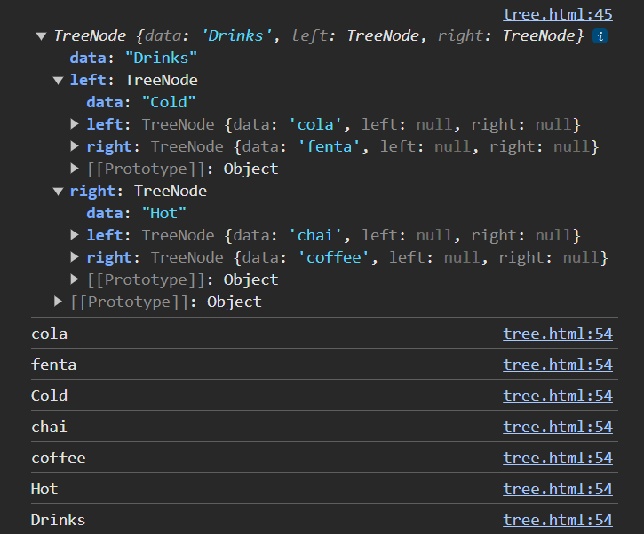

## Create Binary tree


```javascript
 //One node in binary tree contains 3 component
      //root node, left child , right child
      class TreeNode {
        constructor(data) {
          this.data = data;
          this.left = null;
          this.right = null;
        }
      }

      //Create three node root node, left child , right child
      let binaryTree = new TreeNode("Drinks");
      let leftChild = new TreeNode("Cold");
      let rightChild = new TreeNode("Hot");

      //connect node to left and right child
      binaryTree.left = leftChild;
      binaryTree.right = rightChild;

      console.log(binaryTree);
```
Output :- 


## PreOrder Traversal of Binary Tree


```javascript
 //One node in binary tree contains 3 component
      //root node, left child , right child
      class TreeNode {
        constructor(data) {
          this.data = data;
          this.left = null;
          this.right = null;
        }
      }

      //Create three node root node, left child , right child
      let binaryTree = new TreeNode("Drinks");
      let leftChild = new TreeNode("Cold");
      let rightChild = new TreeNode("Hot");

      //connect node to left and right child
      binaryTree.left = leftChild;
      binaryTree.right = rightChild;

      //preorderTraversal
      function preOrderTraversal(rootNode) {
        if (rootNode === null) {
          return;
        }
        console.log(rootNode.data);
        preOrderTraversal(rootNode.left);
        preOrderTraversal(rootNode.right);
      }
      preOrderTraversal(binaryTree);
```

Output:-
Drinks
Cold
Hot


## InOrder Traversal of Binary Tree


```javascript
 //One node in binary tree contains 3 component
      //root node, left child , right child
      class TreeNode {
        constructor(data) {
          this.data = data;
          this.left = null;
          this.right = null;
        }
      }

      //Create three node root node, left child , right child
      let binaryTree = new TreeNode("Drinks");
      let leftChild = new TreeNode("Cold");
      let rightChild = new TreeNode("Hot");
      let chai = new TreeNode("chai");
      let coffee = new TreeNode("coffee");

      let cola = new TreeNode("cola");
      let fenta = new TreeNode("fenta");

      //connect node to left and right child
      //drink -- cold ---hot
      binaryTree.left = leftChild;
      binaryTree.right = rightChild;

      //connect hot to left and right child
      //hot  -- chai -- coffee
      rightChild.left = chai;
      rightChild.right = coffee;

      //connect cold to left and right child
      //cold  -- cola -- fenta
      leftChild.left = cola;
      leftChild.right = fenta;

      console.log(binaryTree);

      //inOrdertraversal
      function inOrderTraversal(rootNode) {
        if (rootNode === null) {
          return;
        }
        inOrderTraversal(rootNode.left);
        console.log(rootNode.data);
        inOrderTraversal(rootNode.right);
      }

      inOrderTraversal(binaryTree);
```


Output:- 


## PostOrder Traversal of Binary Tree


```javascript
 //One node in binary tree contains 3 component
      //root node, left child , right child
      class TreeNode {
        constructor(data) {
          this.data = data;
          this.left = null;
          this.right = null;
        }
      }

      //Create three node root node, left child , right child
      let binaryTree = new TreeNode("Drinks");
      let leftChild = new TreeNode("Cold");
      let rightChild = new TreeNode("Hot");
      let chai = new TreeNode("chai");
      let coffee = new TreeNode("coffee");

      let cola = new TreeNode("cola");
      let fenta = new TreeNode("fenta");

      //connect node to left and right child
      //drink -- cold ---hot
      binaryTree.left = leftChild;
      binaryTree.right = rightChild;

      //connect hot to left and right child
      //hot  -- chai -- coffee
      rightChild.left = chai;
      rightChild.right = coffee;

      //connect cold to left and right child
      //cold  -- cola -- fenta
      leftChild.left = cola;
      leftChild.right = fenta;

      console.log(binaryTree);

      //postOrderTraversal
      function postOrderTraversal(rootNode) {
        if (rootNode === null) {
          return;
        }
        postOrderTraversal(rootNode.left);
        postOrderTraversal(rootNode.right);
        console.log(rootNode.data);
      }

      postOrderTraversal(binaryTree);
```





## level Order Traversal of Binary Tree

```javascript
class TreeNode {
  constructor(data) {
    this.data = data;
    this.left = null;
    this.right = null;
  }
}

// Create nodes from 1 to 10
let node1 = new TreeNode(1);
let node2 = new TreeNode(2);
let node3 = new TreeNode(3);
let node4 = new TreeNode(4);
let node5 = new TreeNode(5);
let node6 = new TreeNode(6);
let node7 = new TreeNode(7);
let node8 = new TreeNode(8);
let node9 = new TreeNode(9);
let node10 = new TreeNode(10);

// Manually link nodes to form a balanced binary tree
node1.left = node2;          // 1 -> 2
node1.right = node3;         // 1 -> 3

node2.left = node4;          // 2 -> 4
node2.right = node5;         // 2 -> 5

node3.left = node6;          // 3 -> 6
node3.right = node7;         // 3 -> 7

node4.left = node8;          // 4 -> 8
node4.right = node9;         // 4 -> 9

node5.left = node10;         // 5 -> 10

// The root node is node1
let rootNode = node1;

console.log("Binary Tree Structure:");
console.log(rootNode);

// Level order traversal function
function levelOrderTraversal(rootNode) {
  if (rootNode === null) {
    return;
  }
  let queue = [];
  queue.push(rootNode);
  while (queue.length > 0) {
    let current = queue.shift();
    console.log(current.data);

    if (current.left) {
      queue.push(current.left);
    }
    if (current.right) {
      queue.push(current.right);
    }
  }
}

console.log("Level-Order Traversal:");
levelOrderTraversal(rootNode);
```


## Search 

```javascript
class TreeNode {
  constructor(data) {
    this.data = data;
    this.left = null;
    this.right = null;
  }
}

// Create nodes from 1 to 10
let node1 = new TreeNode(1);
let node2 = new TreeNode(2);
let node3 = new TreeNode(3);
let node4 = new TreeNode(4);
let node5 = new TreeNode(5);
let node6 = new TreeNode(6);
let node7 = new TreeNode(7);
let node8 = new TreeNode(8);
let node9 = new TreeNode(9);
let node10 = new TreeNode(10);

// Manually link nodes to form a balanced binary tree
node1.left = node2;          // 1 -> 2
node1.right = node3;         // 1 -> 3

node2.left = node4;          // 2 -> 4
node2.right = node5;         // 2 -> 5

node3.left = node6;          // 3 -> 6
node3.right = node7;         // 3 -> 7

node4.left = node8;          // 4 -> 8
node4.right = node9;         // 4 -> 9

node5.left = node10;         // 5 -> 10

// The root node is node1
let rootNode = node1;

console.log("Binary Tree Structure:");
console.log(rootNode);

// Level order traversal function
function levelOrderTraversal(rootNode) {
  if (rootNode === null) {
    return;
  }
  let queue = [];
  queue.push(rootNode);
  while (queue.length > 0) {
    let current = queue.shift();
    console.log(current.data);

    if (current.left) {
      queue.push(current.left);
    }
    if (current.right) {
      queue.push(current.right);
    }
  }
}

console.log("Level-Order Traversal:");
levelOrderTraversal(rootNode);

// Search function
function searchBt(rootNode, value) {
  if (rootNode === null) {
    return "Binary tree does not exist";
  }

  let queue = [];
  queue.push(rootNode);

  while (queue.length > 0) {
    let current = queue.shift();

    if (current.data === value) {
      return "Success";
    }

    if (current.left) {
      queue.push(current.left);
    }
    if (current.right) {
      queue.push(current.right);
    }
  }

  return "Not found";
}

console.log(searchBt(rootNode, 3)); // Output: Success
console.log(searchBt(rootNode, 11)); // Output: Not found
```


## Level Order Insertion

```javascript
class TreeNode {
  constructor(data) {
    this.data = data;
    this.left = null;
    this.right = null;
  }
}

// Create nodes from 1 to 10
let node1 = new TreeNode("1");
let node2 = new TreeNode("2");
let node3 = new TreeNode("3");
let node4 = new TreeNode("4");
let node5 = new TreeNode("5");
let node6 = new TreeNode("6");
let node7 = new TreeNode("7");
let node8 = new TreeNode("8");
let node9 = new TreeNode("9");
let node10 = new TreeNode("10");

// Manually link nodes to form a balanced binary tree
node1.left = node2;          // 1 -> 2
node1.right = node3;         // 1 -> 3

node2.left = node4;          // 2 -> 4
node2.right = node5;         // 2 -> 5

node3.left = node6;          // 3 -> 6
node3.right = node7;         // 3 -> 7

node4.left = node8;          // 4 -> 8
node4.right = node9;         // 4 -> 9

node5.left = node10;         // 5 -> 10

// The root node is node1
let rootNode = node1;

console.log("Binary Tree Structure:");
console.log(rootNode);

// Level order traversal function
function levelOrderTraversal(rootNode) {
  if (rootNode === null) {
    return;
  }
  let queue = [];
  queue.push(rootNode);
  while (queue.length > 0) {
    let current = queue.shift();
    console.log(current.data);

    if (current.left) {
      queue.push(current.left);
    }
    if (current.right) {
      queue.push(current.right);
    }
  }
}

console.log("Level-Order Traversal:");
levelOrderTraversal(rootNode);

// Search and insert function
function searchBt(rootNode, value) {
  if (rootNode === null) {
    return "Binary tree does not exist";
  }

  let queue = [];
  queue.push(rootNode);

  while (queue.length > 0) {
    let current = queue.shift();

    if (!current.left) {
      current.left = new TreeNode(value);
      return "Successfully inserted";
    } else {
      queue.push(current.left);
    }

    if (!current.right) {
      current.right = new TreeNode(value);
      return "Successfully inserted";
    } else {
      queue.push(current.right);
    }
  }

  return "Not found";
}

console.log(searchBt(rootNode, "11")); // Output: Successfully inserted
console.log(searchBt(rootNode, "12")); // Output: Successfully inserted
console.log(searchBt(rootNode, "13")); // Output: Successfully inserted
console.log(searchBt(rootNode, "14")); // Output: Successfully inserted
console.log(rootNode);
levelOrderTraversal(rootNode);
```


## ex: Level Order traversl 2

```javascript
 class TreeNode {
        constructor(data) {
          this.data = data;
          this.left = null;
          this.right = null;
        }
      }

      let drinks = new TreeNode("Drinks");
      let hot = new TreeNode("Hot");
      let cold = new TreeNode("Cold");
      drinks.left = hot;
      let chai = new TreeNode("Chai");
      let coffee = new TreeNode("Coffee");
      hot.left = chai;
      hot.right = coffee;
      drinks.right = cold;
      let alcoholic = new TreeNode("alcoholic");
      let nonAlcoholic = new TreeNode("nonAlcoholic");
      cold.left = alcoholic;
      cold.right = nonAlcoholic;

      function levelOrderTraversal(rootNode) {
        if (rootNode === null) {
          return "tree is traversed";
        } else {
          let queue = [];
          queue.push(rootNode);

          while (queue.length > 0) {
            let n = queue.shift();
            console.log(n.data);
            if (n.left) {
              queue.push(n.left);
            }
            if (n.right) {
              queue.push(n.right);
            }
          }
        }
      }
      console.log(drinks);
      console.log(levelOrderTraversal(drinks));
```


