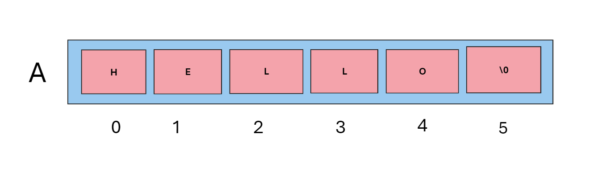

# Changing Case

1. Lower to Upper
2. Upper to lower




```c
int main(){
char A[] = "HELLO";
}
```

We know that ASCII code for 

```c

A --- 65
B --- 66
-
-
Z --- 90

```
```c

a --- 97
b --- 98
-
-
z --- 122

```

You have to change `W to w`


```c

65 ---> 97 ==== > 97-65 = 32

//A --> a

// all have same differnece so just add 32 to upperCase to make it lower and subtract 32 from lower case to get uppercase
```


```c

#include <stdio.h>

int main() {
    char ch = 'A';  // Example uppercase character

    // Convert to lowercase by adding 32
    ch = ch + 32;

    // Output the converted character
    printf("Converted character: %c\n", ch);

    return 0;
}

```

or 

```c
#include <stdio.h>

int main() {
    char A[] = 'HELLO';  // Example uppercase character
    let i;
    for(){
 
}

    return 0;
}
```


